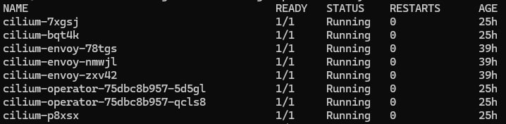
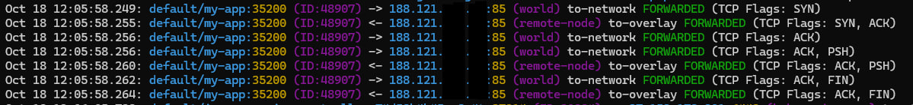
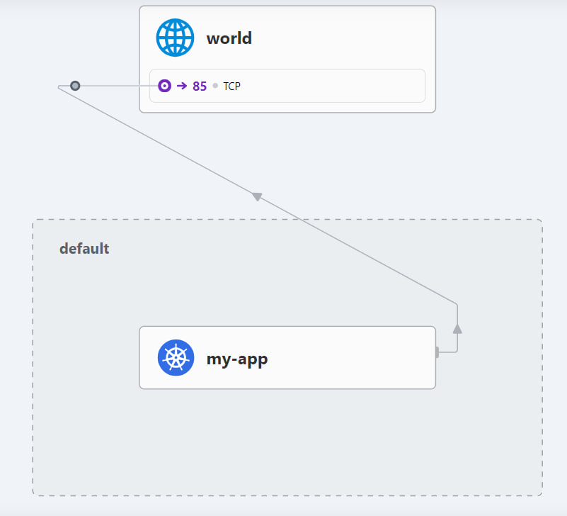
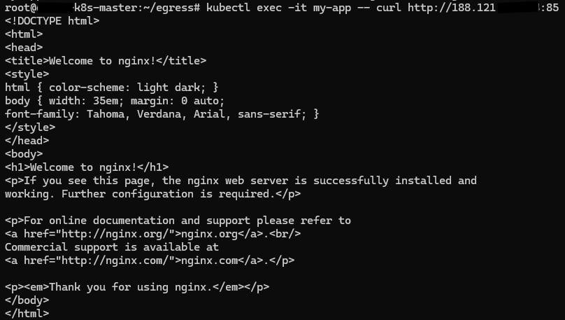
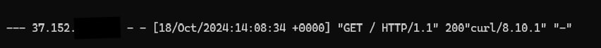

# Cilium Egress Gateway Policy

In this scenario, we want to route traffic from a Kubernetes node to specific external destinations. For example, there may be a need to whitelist an IP address, ensuring that traffic from a certain application pod is directed to a designated external service or endpoint.

### The Problem

Kubernetes dynamically manages pods, meaning that a pod can be rescheduled onto a different node due to scaling, updates, or other reasons. When this happens, the pod's egress IP address changes to match that of the new node. This can cause issues in environments where strict network policies are in place, such as whitelisting specific IPs to access external services.

For instance, if an IP address has been whitelisted for traffic while a pod resides on one node, and then the pod is rescheduled to another node, the change in its egress IP could result in the external service rejecting the connection. This creates a problem in maintaining reliable, continuous communication between the pod and the destination service.

### The Solution: Cilium Egress Gateway Policy

To solve this problem, we use the `CiliumEgressGatewayPolicy`. This policy ensures that traffic from specific pods is routed through a designated gateway node with a fixed, known IP address, regardless of where the pod is scheduled. This allows traffic to be consistently routed to external destinations using the correct egress IP, preventing disruptions caused by pod rescheduling or IP address changes.

By applying the `CiliumEgressGatewayPolicy`, we can enforce custom egress routing and avoid the challenges of dynamic pod rescheduling. This ensures a stable, predictable networking setup, especially when interacting with external systems that rely on fixed IP-based access control.

## Install Cilium

We use Helm to install Cilium. In the Helm values file, we need to enable three features: `egressGateway`, `bpf masquerade`, and `kubeproxy replacement`:

```bash
# Enable the required features

helm install cilium cilium/cilium --version 1.16.2 --namespace kube-system --set egressGateway.enabled=true --set bpf.masquerade=true --set kubeProxyReplacement=true
```

After the upgrade/install, restart the agent pod and operator pod to make the changes effective:

```bash
kubectl rollout restart ds cilium -n kube-system

kubectl rollout restart deploy cilium-operator -n kube-system
```



## Egress Gateway Policy and Testing It

Here is an example of an egress gateway policy:

```yaml
# Cilium egress gateway policy

apiVersion: cilium.io/v2
kind: CiliumEgressGatewayPolicy
metadata:
  name: egress-sample
spec:
  egressGateway:
    nodeSelector:
      matchLabels:
        # We set the egress-node=true label on the node we want to be the egress gateway
        egress-node: "true"
        kubernetes.io/hostname: "k8s-worker-2"

    # If a node has multiple interfaces, we can set a specific interface to route the traffic
    interface: eth0

  # our destination, set it with CIDRs
  destinationCIDRs:
    - a.b.0.0/16
    - a.b.c.0/24

  # route the traffic of which pod or pods 
  selectors:
  - podSelector:
      matchLabels:
        app: my-app
```

An application for testing:

```yaml
# Sample Curl pod

apiVersion: v1
kind: Pod
metadata:
  name: my-app
  labels:
    app: my-app
spec:
  containers:
  - name: my-app
    image: curlimages/curl
    command: ["sleep", "3600"]
  nodeSelector:
    # Ensure this pod is scheduled on another node
    kubernetes.io/hostname: k8s-worker-1
```

To test the policy, you can run the following command:

```bash
kubectl exec -it my-app -- curl http://destination-ip:port
```

the routing in hubble CLI:



in GUI:



application pod:



destination logs:



## Adding a Label to the Node and Troubleshooting

To add a label to a node:

```bash
kubectl label nodes k8s-worker-2 egress-node=true
```

You can view the egress configuration on the Cilium agent with:

```bash
kubectl -n kube-system exec ds/cilium -- cilium-dbg bpf egress list

# Example output
Source IP       Destination CIDR    Egress IP   Gateway IP
192.168.1.126   188.1xx.xxx.xx/32   0.0.0.0     37.1xx.xxx.xxx
```

The `Source IP` address matches the IP address of the pod that corresponds to the `podSelector` policy.
The `Gateway IP` matches the (internal) IP address of the egress node that corresponds to the policy's `nodeSelector`.
The `Egress IP` is `0.0.0.0` on all agents except for the one running on the egress gateway node, where you should see the Egress IP address being used for the traffic. If an `egressIP` is specified in the policy, this will be reflected in the output.
